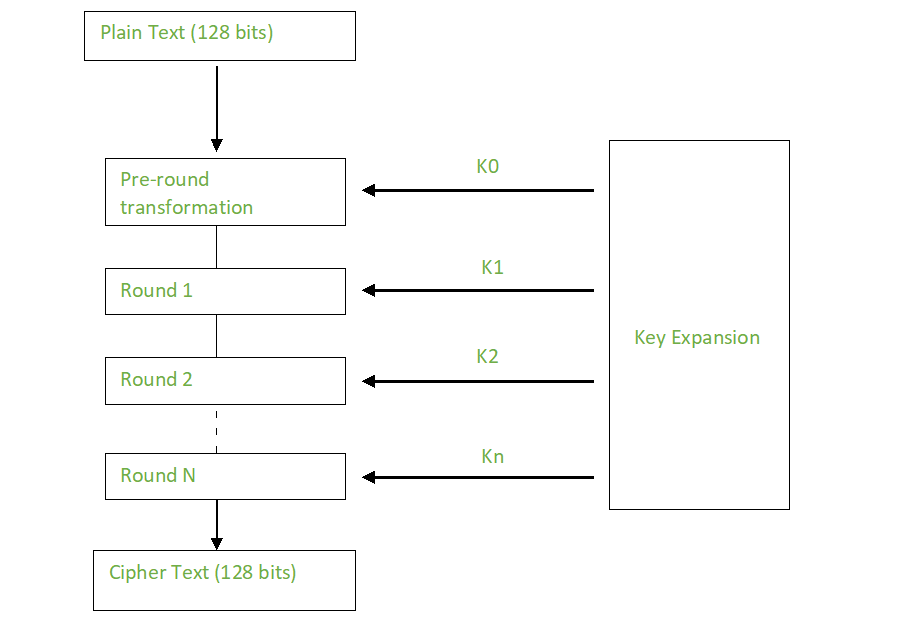
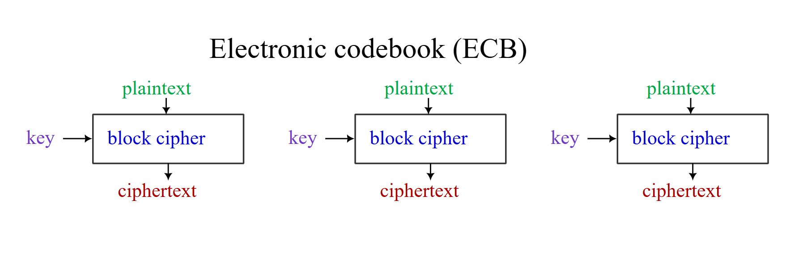
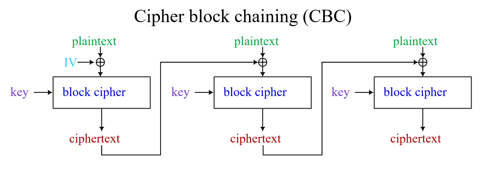
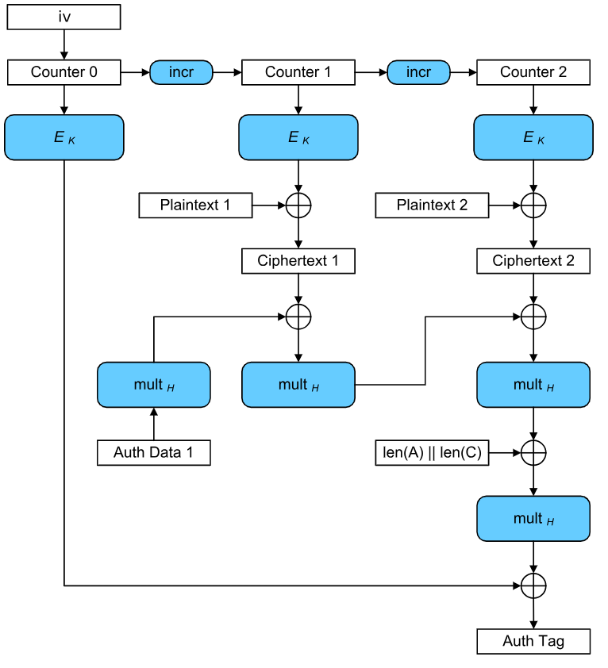

# Cryptanalysis on Symmetric Ciphers: DES & AES

**Students:**
* Chu Quang Cường - 24520236
* Nguyễn Trọng Nhân - 24520023

**Lecturer:** Nguyễn Ngọc Tự

---

## 1. Overview

- Scenario: A financial institution is undergoing a critical infrastructure upgrade. They possess legacy databases encrypted with DES and are migrating to an AES-256 standard. They need to conduct a cryptanalytic audit to demonstrate the immediate risks of the legacy DES data to stakeholders and validate the resilience of the new AES implementation against modern attack vectors.

- Gaps: DES is computationally insecure by modern standards due to its short 56-bit key length, making it highly susceptible to brute-force attacks and linear cryptanalysis. While AES is robust, it can still be vulnerable to implementation flaws, such as using weak modes of operation (e.g., ECB) or side-channel attacks (e.g., power analysis) if not deployed correctly.

- Motivations: To justify the resources required for a complete migration from legacy systems, ensure compliance with strict data protection regulations (like PCI-DSS), and guarantee the long-term confidentiality of sensitive client financial data.
---

## 2. Proposed solution
### Solution architecture

### 2.1. DES (Data Encryption Standard)
* **Structure:** Feistel Network.
* **Key:** 56-bit (effective).
* **Block:** 64-bit.
* **Issues:** The 56-bit key size is trivially **vulnerable to brute-force** by modern hardware. The 64-bit block size is also a weakness, leading to "Sweet32" collision attacks on 3DES when encrypting large amounts of data.

### 2.2. AES (Advanced Encryption Standard)
* **Structure:** Substitution-Permutation Network (SPN).
* **Key:** 128, 192, or 256-bit.
* **Block:** 128-bit.
* **Strength:** Theoretically, no practical attack against full-round AES is more efficient than brute-force.

### 2.3. Modes of Operation
AES/DES only encrypt a single, fixed-size block. To encrypt longer data, they require a "mode of operation," which is often the source of real-world vulnerabilities.
* **ECB (Electronic Codebook):** Insecure. Leaks data patterns.

* **CBC (Cipher Block Chaining):** Requires a random IV and, critically, careful padding handling. If not, it is vulnerable to **Padding Oracle attacks**.

* **GCM (Galois/Counter Mode):** An AEAD (Authenticated Encryption) mode. It is fast and secure, *BUT* it is **catastrophic if a Nonce (IV) is reused**. Reusing a nonce with the same key leads to a complete loss of confidentiality and integrity.

---

## 3. Real-World Weaknesses & Attack Vectors

This is the core of our analysis: attacks that target the *implementation* of AES, not its *mathematics*.

### 3.1. Web / TLS Scenarios
* **Padding Oracle (on AES-CBC):** One of the most common web application attacks. If a server returns different error messages (or different response times) for invalid padding versus an invalid MAC, an attacker can decrypt data byte-by-byte without the key. (e.g., Vaudenay, Lucky13).
* **GCM Nonce Reuse (on AES-GCM):** A security catastrophe. If a TLS server (or any system) reuses the same (key, nonce) pair to encrypt two different messages, an attacker can recover the plaintext. This can happen due to faulty Random Number Generators (RNGs) or bad implementations.
* **Sweet32 (on 3DES):** Legacy servers still supporting 3DES (a 64-bit block cipher) are vulnerable to a birthday attack that can extract authentication cookies after capturing gigabytes of traffic.

### 3.2. Cloud (Multi-Tenant) Scenarios
* **Cache-Timing Attacks:** In a cloud environment, your VM may run on the same physical CPU as an attacker's VM. If a crypto library (like an old version of OpenSSL) uses T-tables to speed up AES, the attacker can use **Flush+Reload** techniques to monitor cache access and recover the AES key.

### 3.3. IoT / Embedded Scenarios
* **Side-Channel & Fault Injection:** IoT devices often lack physical protections. An attacker with physical access can measure power consumption or electromagnetic (EM) radiation during AES operations to extract the key.
* **Hard-coded Keys:** Many IoT devices embed encryption keys directly in their firmware, making them easy to extract via reverse engineering.

---

## 4. Methodology & Experiments

This project will implement safe Proof-of-Concepts (PoCs) in a lab environment to measure and verify these attacks.

* **Experiment A — DES Brute-force:** Use tools like Hashcat with a GPU to measure the real-world time required to break a 56-bit DES key, demonstrating its obsolescence.
* **Experiment B — Padding Oracle (AES-CBC):** Deploy a deliberately vulnerable web API and write a script (e.g., padbuster-style) to automatically decrypt a secret token.
* **Experiment C — GCM Nonce Reuse:** Simulate nonce reuse in AES-GCM and demonstrate how an attacker can recover plaintext or forge a message.
* **Experiment D — Cache-Timing PoC (Flush+Reload):** Set up a "spy" process and a "victim" process (using a vulnerable OpenSSL version) on the same machine to perform a Flush+Reload attack and recover bytes of the AES key.
* **Experiment E — Fault Attack (DFA) on AES:** if lab allows, use glitching/fault injection to create faulty ciphertexts and attempt key recovery for reduced rounds; discuss constraints and ethics.
---

## 5. Tools & Implementation

* **Software:** OpenSSL (various versions), Python (with `pycryptodome`), Hashcat, PoC scripts for padding oracles, PoC scripts for cache-timing.
* **Hardware (Recommended):** GPU (NVIDIA) for brute-force, IoT boards (ESP32/STM32), ChipWhisperer for side-channel analysis.
* **Environment:** Docker (for containerizing vulnerable services), VMs (for multi-tenancy experiments).

---

## 6. Best Practices & Real-World Takeaways

The experimental results will lead to critical operational recommendations:

1.  **Always Prefer AEAD:** Use AEAD modes like **AES-GCM** or **ChaCha20-Poly1305** instead of older modes like CBC. They provide both encryption and authentication.
2.  **Nonce Management is Critical:** When using GCM or CTR, you *must* ensure the nonce is unique for every encryption operation with the same key.
3.  **Use "Constant-Time" Implementations:** Avoid custom crypto or old libraries. Prefer libraries that use **AES-NI** (hardware AES instructions on modern CPUs), which are designed to resist timing and cache-based side-channel attacks.
4.  **Do Not Leak Error Details:** Never reveal information about *why* a decryption failed. Handle padding errors, MAC failures, etc., with a single, generic error message in constant time to prevent padding oracles.
5.  **Key Management:** Use a Key Management System (KMS) or Hardware Security Module (HSM) to store and rotate keys. Never hard-code keys in applications or firmware.